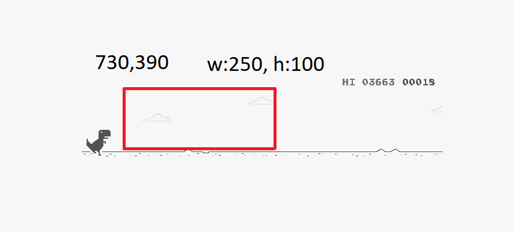
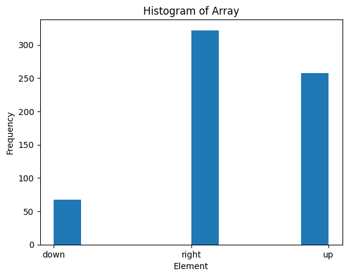

# Self-Playing T-Rex Game Project

## Overview

This project aims to train a model to play the T-Rex game using a self-playing approach.  The model is designed using a convolutional neural network (CNN) with layers below. The training data consists of screenshots of the game, which are normalized.

## Model Summary

Model: "sequential"

---

Layer (type) Output Shape Param

conv2d_4 (Conv2D) (None, 248, 98, 32) 320

conv2d_5 (Conv2D) (None, 246, 96, 64) 18496

max_pooling2d_2 (MaxPooling (None, 123, 48, 64) 0  
2D)

dropout_4 (Dropout) (None, 123, 48, 64) 0

flatten_2 (Flatten) (None, 377856) 0

dense_4 (Dense) (None, 128) 48365696

dropout_5 (Dropout) (None, 128) 0

dense_5 (Dense) (None, 3) 387

=================================================================  
Total params: 48,384,899  
Trainable params: 48,384,899  
Non-trainable params: 0  

---

## Installation

To install the required packages, you can run the following command:

`pip install -r requirements.txt`

## Usage

- ## Data Collection

## [Game Link](https://fivesjs.skipser.com/trex-game/)

You can use the script provided in save.py to automate this process. 
You have to set your own coordinates for both play.py and save.py.

I recommend to select the box according to this. Notice that (730,390) is my top left coordinates in whole screen. You can set up yours. 
I also recommend to set width to 250 pixels, height to 100 pixels.

Run the script, press "up" to record jump screenshots and "down" to crouch screenshots. Make sure that regularly press "right" to collect normal running data.

This is the dataset that I collected. Having a balanced dataset is the key of this process. As you can see, I have a balance between "right" and "up" but there is low amount of "down" data.

- ## Data Preprocessing

To train the model, run the training.py script or training.ipynb for Jupyter Notebook **(I recommend running Jupyter Notebook)**.

- ## Model Testing

To test the model, run the play.py script. This will load the trained model and simulate the T-Rex game using the model's predictions. Remember to change coordinates according to your screen.

## Conclusion

The model is pretty well trained to jump over obstacles at the right time. Due to lack of crouching images, model missed the crouch spot.

## **NOTE**  

Game speed is changing dynamically. So as you progress through the game, your jump point gets farther away. You can change delay variable at play.py. Finding the right delay can be challenging.

## Requirements

Python 3.6+

- keras==2.12.0rc1
- keyboard==0.13.5
- mss==7.0.1
- numpy==1.24.2
- Pillow==9.5.0
- scikit_learn==1.2.2

### Author

- LinkedIn - [Ömer Fatih Bülbül](https://www.linkedin.com/in/ömer-fatih-bülbül-74a890236/)
- Twitter - [fatihbulbul91](https://twitter.com/fatihbulbul91)
